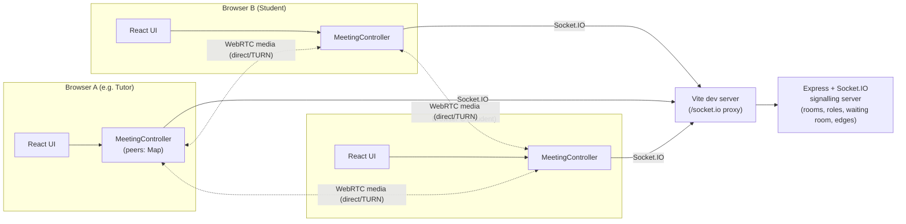

# LearnThrive Meeting Prototype

A separate, experimental browser classroom for LearnThrive Tuition: one tutor plus up to three students (4 participants max). React and native WebRTC provide camera, microphone, screen sharing and peer media over a direct mesh (each participant connects to every other one); a small Express/Socket.IO server coordinates room membership, tutor/student roles, a waiting room the tutor admits students from, and relays an ephemeral text chat. This is a technical proof of concept, not a production tuition platform — see [PRODUCTION_GAPS.md](PRODUCTION_GAPS.md) for what real classroom use would still need, including the eventual move to a proper SFU (see [Architecture](#architecture)).

Everything lives in `D:\LearnThriveSoftware`. The marketing project at `D:\LearnThrive` is a read-only brand reference. Public logo assets were copied from its `public\brand` directory and its favicon into this project's `public\brand`; there are no runtime imports from the marketing project.

## Requirements

- Node.js **22.12 or later**, with npm. **Node 24 LTS** is recommended; see the [official Node release schedule](https://nodejs.org/en/about/previous-releases).
- A modern browser with WebRTC support: current Chrome, Edge, or Firefox are actively tested (see [Browser support](#browser-support)). Safari/iOS work is expected but has not been verified on this Windows development machine.
- Camera/microphone permissions for participants who want to send media. Joining with both disabled is supported.
- Headphones for local testing.
- Optional [Tailscale](https://tailscale.com/) (recommended) or `cloudflared` for a temporary HTTPS test on two physical devices — see [TAILSCALE_TESTING.md](TAILSCALE_TESTING.md) and [LAPTOP_PHONE_TEST.md](LAPTOP_PHONE_TEST.md). Neither is needed for local same-machine testing, and neither is installed or started by this project.

## Install and start

In PowerShell:

```powershell
cd D:\LearnThriveSoftware
npm install
npm run dev
```

Open **http://localhost:5173**. If your system resolves localhost to an unavailable IPv6 address, use **http://127.0.0.1:5173** consistently in both browser sessions.

One `npm run dev` command starts Vite on loopback port **5173** and the signalling server on loopback port **3001**. Keep that terminal open. Press `Ctrl+C` to stop both. Ports are fixed so another application on either port should be stopped or reconfigured before starting this project.

**Create meeting** to start a class as its tutor (this mints a fresh room code and enters you immediately), or enter an existing room code and **Join meeting** to join as a student. Prepare your camera/microphone in the pre-join screen first. A student who joins lands in a waiting room and only enters the class once the tutor admits them (from the **Waiting room** control once in the call) — this is deliberate, not a bug: every student always waits for the tutor, even if seats are free. Copy the invite link to bring in students; opening an invite does not automatically enter the meeting.

For a real laptop ↔ phone test, see **[LAPTOP_PHONE_TEST.md](LAPTOP_PHONE_TEST.md)**.

## Commands

| Command | Purpose |
| --- | --- |
| `npm run dev` | Start the frontend and signalling server together |
| `npm run lint` | Check TypeScript/React source with ESLint |
| `npm run typecheck` | Type-check without emitting files |
| `npm test` | Run focused automated tests (Vitest) |
| `npm run test:browser` | Run real-browser checks with synthetic media (Playwright, Chromium + Firefox) |
| `npm run build` | Type-check and build the production frontend into `dist` |

The frontend build does not start or package a production signalling service. Use `npm run dev` for the documented local experiments. See [TESTING.md](TESTING.md) for browser-test prerequisites, the full manual test matrix, and the verification record.

## Architecture



```text
Local HTTP / optional temporary HTTPS entry point
    -> Vite :5173
       -> /socket.io HTTP + WebSocket proxy -> Express/Socket.IO :3001
```

The browser Socket.IO client uses the current origin (`io()`), so the same room works locally and through one HTTPS tunnel. Browser-facing signalling configuration contains no hard-coded localhost URL.

**Capacity and roles.** Exactly one **tutor** plus up to three **students** — 4 admitted participants max (`MAX_PARTICIPANTS` in `shared/protocol.ts`). Whoever clicks **Create meeting** is the tutor for that (freshly-generated) room; there is no UI path to join an existing room as a tutor, and the server independently enforces both caps regardless of what a client claims. Every student always lands in a **waiting room** first and needs the tutor to explicitly **Admit** them (or **Admit all**) — this holds even if seats are free, since a classroom shouldn't let a student go live with nobody having let them in. The waiting room has its own small abuse-prevention cap (`WAITING_ROOM_CAP`), independent of the 3-student limit.

**Mesh negotiation (P2P, not an SFU — see below).** A room with N admitted participants has up to `N × (N-1) / 2` direct `RTCPeerConnection` edges (6 at the 4-person maximum) — `MeetingController` holds a `Map<peerId, PeerSession>` instead of one singular peer. Each edge gets its own server-issued session id and initiator, decided once at the moment that edge is created (whoever was already admitted initiates towards the newcomer) — this is *not* the same as "whoever joined the room first," which stops working correctly once there are 3+ participants (an edge between two students who both joined after the tutor has neither end equal to "the first participant," so that older shortcut would leave such an edge unable to negotiate at all). ICE candidates received before a remote description is set are queued per edge. The initiator of a given edge also owns ICE restart on a persistent failure for that edge only, so its two ends can never both start a fresh offer at once (no negotiation storms), and one struggling edge can't affect the others.

**Signalling server.** Holds room membership (admitted participants, the waiting queue, and the current set of edges) in memory, validates all input, and forwards signalling, chat, and screen-share/hand/reaction state only between participants confirmed to be in the same room — WebRTC offer/answer/ICE are routed to the *specific* other participant on that edge, never broadcast room-wide. It cleans up membership, the waiting queue, and edges on leave/disconnect (with the same disconnect-grace-period protection for a waiting student as for an admitted one, so a brief blip doesn't silently drop their place in the queue). It does **not** proxy, process or store audio/video, and it does not persist chat. Media travels directly between WebRTC peers, or through an optional TURN relay when a direct route cannot be established.

**Client controllers.** `MeetingController` (`src/meeting.ts`) owns Socket.IO, room/chat/device/screen-share state and orchestrates a `PeerSession` (`src/peer.ts`) per other admitted participant — `PeerSession` itself is unchanged from a 2-person design and is fully self-contained per edge (no shared mutable state), so running several concurrently is safe. `LocalMedia` (`src/media.ts`) owns camera/microphone tracks independently of room membership, so mute/camera-off/device-switch never tears down or reacquires more than the one track being changed, and fans the same track out to every active `PeerSession` (one `MediaStreamTrack` backing multiple `RTCRtpSender`s across multiple connections is standard WebRTC). Normal mute/camera controls toggle the existing track's `enabled` state; device switches and screen sharing use `RTCRtpSender.replaceTrack()` on every active connection — none of these renegotiate. WebRTC connection state and Socket.IO signalling state are tracked per peer and reported separately; the one headline "Connected"-style pill is a worst-of aggregate across all current peers (`aggregateConnectionStatus` in `src/callStatus.ts`), and a connected socket alone never claims the call is connected.

**Why P2P mesh and not an SFU.** A Cloudflare Realtime SFU is the intended target architecture for a real classroom (controlled per-client upload, easier multi-party screen sharing, centrally-managed quality) — but that needs a real Cloudflare account and app credentials, which this build doesn't have. The mesh is a deliberate, working interim: it costs more client bandwidth/CPU than an SFU would (each participant uploads to every other one directly — up to 3 simultaneous outgoing streams at full capacity), which is an accepted tradeoff for a prototype, not something to rely on at real scale.

## Reconnection architecture

A signalling blip does not necessarily mean the call is broken — the underlying `RTCPeerConnection` keeps flowing independently of the Socket.IO channel, so a brief Wi-Fi hiccup on either side shouldn't tear down a still-healthy call. The client no longer closes its peer connection just because its own socket disconnected; it only reflects the real WebRTC state, which is reported separately.

On the server, `disconnect` doesn't immediately declare a departure. It starts a short grace period (`DISCONNECT_GRACE_MS`, default 10s) during which the peer is told "X is reconnecting..." rather than "X left". If the same browser tab reconnects within that window, Socket.IO's native `connectionStateRecovery` typically resumes the *same* socket id and server-side session data, so the peer is told "reconnected" and nothing else changes. If the grace period expires with no recovery, the departure is announced as normal, and a genuinely new participant can immediately take the freed slot without waiting out anyone else's grace period. A full page refresh has no recovery session (browser state is gone), so it correctly behaves like a fresh join, not a resume — this is intentional, matching the "Handle Refreshes" requirement.

Explicit "Leave" is always immediate — no grace period — and is now acknowledged by the server (`room:leave` waits for the server to confirm it processed the departure, with a bounded fallback) before the client disconnects its transport. This closes a real race found while building this: emitting `room:leave` and immediately disconnecting could lose the message on the wire, and a fast rejoin to the same room would then pair with the departing socket's own stale ghost and later see a false "Participant left" about itself.

The client also exposes explicit states beyond connected/disconnected: **Reconnecting...**, **Unable to reconnect** (after Socket.IO's own bounded reconnection attempts are exhausted, with a manual **Reconnect** button), and a subtle **"X is reconnecting..."** note for the peer — none of which freeze the meeting UI.

## Screen sharing

Uses `navigator.mediaDevices.getDisplayMedia()` and replaces the existing outgoing video sender's track via `RTCRtpSender.replaceTrack()` — no second `RTCPeerConnection`, no renegotiation. The camera track keeps running underneath (never torn down), so stopping a share restores exactly the state it was in before: still on if it was on, still off if it was off. The browser's native "Stop sharing" bar is handled via the display track's `ended` event, the same as the in-app Stop button. On the receiving side, the remote tile switches to `object-fit: contain` (so a screen isn't cropped the way a face is) with a "presenting" badge; this is driven by an explicit `participant:screen-share` signal, not inferred from the video track itself, so a peer sharing with their camera off still displays correctly. Both the tutor and students may share, subject to the room's screen-share policy (see [Classroom moderation](#classroom-moderation-polls-understanding-checks-and-the-class-timer) above); ownership is arbitrated server-side so only one participant can share at a time, and it's released reliably on an explicit stop, a disconnect, a removal, or the tutor ending the class — never left permanently stuck.

The browser's own picker remains authoritative over tab/window/screen choice — this app never enumerates or selects a source itself. On Chromium, three hint properties are passed to `getDisplayMedia` (silently ignored by browsers that don't support them): `selfBrowserSurface: 'exclude'` (don't offer this app's own tab, avoiding an infinite-mirror pick), `surfaceSwitching: 'include'` (let the presenter switch which tab/window/screen is shared without restarting the capture), and `systemAudio: 'include'` (surface a "share tab/system audio" checkbox). When the browser supplies a screen-audio track, it's mixed with the microphone via Web Audio (`AudioContext` + `MediaStreamAudioSourceNode`/`MediaStreamAudioDestinationNode`) rather than replacing it, so peers hear both at once; the Share screen control shows "Sharing audio" once that's active. Feature-detected: the control is hidden entirely where `getDisplayMedia` doesn't exist (this includes essentially all mobile browsers, which is expected — receiving another participant's share works fine on mobile, only *initiating* one requires desktop display capture). Picker cancellation and permission denial both show a calm "Screen sharing was cancelled or blocked by your browser." message rather than a raw exception. A reentrancy guard prevents a double-click (or the `S` keyboard shortcut landing alongside a click) from starting two captures at once and leaking one.

## Chat

Ephemeral, relayed only through the existing Socket.IO connection — nothing is stored server-side or persisted anywhere, and messages disappear when the meeting ends. Validated server-side (trimmed, length-capped, rejected if empty/oversized/malformed, rejected if the sender isn't confirmed to be in that room) and rate-limited per connection. Rendered as plain text only: React's default text-node escaping means there is no markdown parsing and no `dangerouslySetInnerHTML` anywhere in the chat UI, so a message like `` displays as literal visible text — verified in a real browser, not just asserted. Desktop shows a collapsible side panel; mobile shows a full-height sheet. An unread count appears on the Chat control while the panel is closed.

## Device selection and switching

Pre-join and in-call menus list cameras/microphones via `navigator.mediaDevices.enumerateDevices()` (labels only populate once permission has been granted once). Changing a device obtains a new track and replaces the sender's track with `RTCRtpSender.replaceTrack()` — the call is never torn down. A device preference is only applied to live hardware if that kind is currently enabled, so choosing a different camera while the camera is off doesn't unexpectedly wake it. `navigator.mediaDevices.devicechange` is handled: device lists refresh automatically, and if the currently-selected device disappears (e.g. a USB webcam unplugged), the app falls back to the default device with a message instead of crashing. On mobile, a front/rear camera flip (via `facingMode`) appears only when more than one camera is actually available.

## Connection quality and diagnostics

`RTCPeerConnection.getStats()` is polled every 2.5 seconds and parsed into RTT, jitter, packet loss, inbound/outbound bitrate, frame rate, resolution, and ICE candidate types — every field is feature-detected, since Chromium/Firefox/Safari report different subsets. A conservative, deliberately coarse classifier turns that into **Excellent / Good / Fair / Poor**, shown as a small "Connection: Good"-style pill; this is not a precise measurement.

Appending `?debug=1` to the URL reveals a development diagnostics panel with the full detail, per peer: connection/ICE/signalling state, exact local and remote candidate types and the selected pair's transport protocol (udp/tcp — not the raw IP:port, to keep local addresses private), RTT, jitter, packet loss, current inbound/outbound bitrate, cumulative bytes sent/received, frames encoded/decoded, packets sent/received, remote video dimensions and FPS, per-track state (id/enabled/muted/readyState) for local and remote audio/video separately, the requested and actually-negotiated transceiver direction for audio and video, plus room-level state: socket id, room id, participant count, active camera/microphone, screen-share state, hand-raised state, and whiteboard page/element counts. This panel is never shown without the query flag, and doesn't expose raw local IP addresses beyond the candidate type and protocol. See [ASYMMETRIC_VIDEO_TEST.md](ASYMMETRIC_VIDEO_TEST.md) for how to read these fields when diagnosing a one-way video problem, and [TURN_TESTING.md](TURN_TESTING.md) for using them to prove a forced-relay call actually works.

## Layout, People panel, waiting room, hand-raise and reactions

Clicking any tile makes it the main view (Teams-style click-to-focus); this is presentation-only local UI state, kept in React state, and never changes what media is actually sent. Three layout modes — **Focus** (one large tile + up to 3 compact others), **Side-by-side** (roughly equal, only offered with exactly one other participant), and **Gallery** (an adaptive grid, a clean 2×2 at the 4-participant maximum) — are chosen per device from the Settings panel, are not synced to other participants, and are not remembered between meetings. Starting a screen share automatically focuses it and restores whichever view was chosen before sharing when it ends.

The **People** panel lists every participant with a Tutor/Student role badge and live microphone/camera/hand-raised state, plus (for the tutor) per-student moderation actions. The tutor-only **Waiting room** panel lists students waiting to be admitted, with a live count badge, a per-student **Admit** and **Deny**, and an **Admit all** that admits as many as currently fit and reports the rest (e.g. "Admitted 2 — 3 still waiting") rather than either silently dropping the overflow or blocking the whole action. **Raise hand** (also bindable to the `H` key) and **emoji reactions** are both ephemeral, relayed only through the existing Socket.IO connection (never stored, never affecting the admitted-participant cap), with reactions rate-limited server-side and animated briefly on all sides (respecting `prefers-reduced-motion`).

## Classroom moderation, polls, understanding checks, and the class timer

The tutor-only **Class controls** popover holds room-level toggles — **lock the room** (rejects new student joins without touching anyone already in), **mute all students**, and **allow/disallow student screen sharing and chat** — plus launchers for a poll, an understanding check, and a class timer. Per-student actions (**force-mute**, **allow to unmute**, **remove from class**, **lower a raised hand**, **stop an active screen share**) live as buttons on that student's row in the People panel instead of a separate surface, to keep the toolbar itself at one new control.

**Force-mute and stop-share are directives, not real media enforcement** — this is a pure P2P mesh with no SFU, so the signalling server never touches media. "Muted by the tutor" is an instruction the target's own client complies with via the same code path its own mute button uses; a modified client could ignore it. See [PRODUCTION_GAPS.md](PRODUCTION_GAPS.md) for the full trust-boundary note. **Screen-share ownership**, by contrast, *is* server-arbitrated (it's a genuinely new resource with no prior trust model to preserve): only one participant can share at a time, enforced server-side regardless of client behaviour.

**Polls** (2–6 options, optionally anonymous, results visible either immediately or only once closed) and the **Understanding Check** (a quick "got it / confused / lost" pulse-check) are both visible to every participant the moment the tutor starts one, shown as a small banner near the top of the call — not tucked inside a popover, since everyone needs to see and respond to these live. A student only ever sees their own vote/status plus whatever aggregate the tutor has chosen to make visible; anonymous poll voters are hidden even from the tutor. The **class timer** (stopwatch or countdown, with pause/resume/stop) is tutor-controlled and shown to everyone next to the existing call-duration clock; the server only broadcasts state transitions, and each client ticks its own local display between them. A tutor **announcement** (e.g. "5 minutes remaining") is a distinct, prominent, auto-expiring banner — deliberately separate from chat, which it never touches — and the **Help Queue** (tutor-only, auto-surfacing whenever a hand is raised) lists raised hands in the order they were raised with a live elapsed time, building on the existing raise-hand feature rather than a new signal.

When the tutor leaves, the class ends for everyone still in it (a distinct `room:ended` cascade, not the ordinary per-participant "left" notice) — this reaches every still-admitted participant *and* every student still in the waiting room, who previously would have gotten no signal at all and sat there unadmitted forever. "End class" and an ordinary "Leave" are the same action for the tutor (there's only one), differing only in confirmation copy.

See **[CLASSROOM_FEATURES.md](CLASSROOM_FEATURES.md)** for the full feature-by-feature matrix (who can do what, what's server-enforced vs. client-directive, and what's tested).

## Whiteboard and workspace modes

**Call**, **Board**, and **Present** are first-class workspace modes, switchable at any time (also `W` to toggle Board) without tearing down media, chat, polls, the timer, or board state — none of that lives inside the switched view. Starting a screen share automatically surfaces Present for everyone and restores whichever mode was active before it, mirroring the existing focus-restore behaviour for video tiles.

**Board** wraps `@excalidraw/excalidraw` as a real-time collaborative whiteboard: multiple pages (create/rename/duplicate/reorder/delete, each with its own background — blank, lined, grid, dotted, or coordinate, rendered as CSS behind a transparent canvas rather than thousands of drawn elements), incremental sync reconciled by element version/versionNonce (the same merge rule Excalidraw's own collaboration reference implementation uses, so concurrent edits always converge and a stale update can never overwrite a newer one), a tutor-gated student-drawing permission (server-enforced, not just a hidden toolbar), a "Follow Me" nudge with local opt-out for students browsing independently, native cursor/laser-pointer rendering, tutor-only page clear and JSON import, PNG/JSON export, and a handful of lightweight tutoring shortcuts (number line, axes, fraction bar). See **[WHITEBOARD_ARCHITECTURE.md](WHITEBOARD_ARCHITECTURE.md)** for the full sync design and why several of these decisions were made the way they were.

## ICE and optional TURN

ICE configuration is centralised in `src/ice.ts`. The base entry is Cloudflare's public STUN endpoint, `stun:stun.cloudflare.com:3478`.

**STUN-only calling works on many networks, but not all.** Some NAT/firewall combinations require a TURN relay. A working HTTPS tunnel provides application/signalling access; it does not solve WebRTC media traversal. See the [WebRTC project's TURN guide](https://webrtc.org/getting-started/turn-server).

**Temporary Cloudflare Realtime TURN credentials (server-generated, not build-time).** The signalling server exposes `GET /api/turn-credentials` (proxied through Vite the same way `/socket.io` is, so one HTTPS tunnel covers both): when `CLOUDFLARE_TURN_KEY_ID` and `CLOUDFLARE_TURN_API_TOKEN` are set (server-only — never `VITE_`-prefixed, so never bundled into the browser build), it calls Cloudflare's [`generate-ice-servers`](https://developers.cloudflare.com/realtime/turn/) endpoint for a short-lived credential set and returns just the resulting `iceServers` to the browser. The browser never sees the long-lived key/token pair. `src/ice.ts` fetches this once a session starts and again for a later peer connection if the cached set has gone stale, and falls back silently to STUN-only (logged only in development) if the endpoint isn't configured or the request fails — a missing/failed TURN fetch never blocks a meeting, since direct P2P may still work anyway. See **[TURN_TESTING.md](TURN_TESTING.md)** for how to configure a real Cloudflare account and prove the relay path actually works with `?forceTurn=1`.

A manual/self-hosted TURN override remains available independently of the above, useful for testing against a specific known service. Create `.env` from `.env.example` if you do not already have one:

```powershell
Copy-Item .env.example .env
```

Fill in the optional values locally, then restart `npm run dev`:

```dotenv
VITE_TURN_URL=turn:relay.example.com:3478,turns:relay.example.com:5349
VITE_TURN_USERNAME=temporary-test-username
VITE_TURN_CREDENTIAL=temporary-test-credential
```

Multiple TURN URLs (comma-separated) are supported as alternative addresses for the same relay/credential pair. These are placeholders, not an operational relay. Leave all three blank to rely on Cloudflare's temporary credentials (or STUN-only, if those aren't configured either) — this override is additive, not exclusive. `VITE_` values are exposed to browsers and included in frontend builds: they are **not server secrets**, unlike the Cloudflare key/token pair above. Use short-lived, limited TURN credentials, keep actual credentials out of source control and do not place them in public assets. In `?debug=1` mode, the candidate-type readout lets you confirm whether an active call actually used TURN (relay) or connected directly (host/srflx); `?forceTurn=1` forces every connection through a relay so you can prove TURN actually works rather than just being configured — see TURN_TESTING.md.

## Environment variables

All optional; all read from `.env` (never committed — see `.env.example`), or set directly in the shell/tunnel command for the ones that make sense there.

| Variable | Used by | Purpose |
| --- | --- | --- |
| `TUNNEL_HOST` | server + Vite | Adds one exact extra hostname to the allowed origins/hosts, for a **fixed custom domain** (e.g. a future named Cloudflare Tunnel). Not needed for Cloudflare Quick Tunnel or Tailscale — those are already covered automatically by their `.trycloudflare.com`/`.ts.net` suffixes in `shared/allowedHosts.ts`. See [TAILSCALE_TESTING.md](TAILSCALE_TESTING.md) and [LAPTOP_PHONE_TEST.md](LAPTOP_PHONE_TEST.md). |
| `CLOUDFLARE_TURN_KEY_ID` | server only | Cloudflare Realtime TURN key ID. Server-only — never sent to the browser. See [TURN_TESTING.md](TURN_TESTING.md). |
| `CLOUDFLARE_TURN_API_TOKEN` | server only | Cloudflare Realtime TURN API token, paired with the key ID above. Server-only. `GET /api/turn-credentials` returns 503 (treated as "use STUN-only") if either is missing. |
| `VITE_TURN_URL` | browser | Comma-separated TURN/TURNS URL(s) for the manual override. Additive to the Cloudflare temporary credentials above, not a replacement for them. |
| `VITE_TURN_USERNAME` | browser | TURN username for the manual override. Required alongside the two above for it to activate. |
| `VITE_TURN_CREDENTIAL` | browser | TURN credential for the manual override. Same as above — browser-exposed, not a server secret. |
| `DISCONNECT_GRACE_MS` | server | Overrides the default 10-second disconnect grace period. Mainly useful for tests (Playwright's config sets it to 3000ms so the network-drop test isn't slow); production behaviour is the default. |

## Debug mode

Append `?debug=1` to the landing URL, or `&debug=1` to a URL that already contains `?room=...`, and open the browser developer console. See [Connection quality and diagnostics](#connection-quality-and-diagnostics) above for what it shows. Keep diagnostics off in the ordinary meeting flow, and avoid sharing logs containing participant or network details publicly. Development console logging is categorised (`[LearnThrive][signalling]`, `[peer]`, `[ice]`, `[media]`, `[devices]`, `[chat]`, `[stats]`) rather than scattered uncategorised output.

## Browser support

Actively tested with real (fake-device) automated WebRTC calls in this project's own Playwright suite: **Chrome/Chromium** and **Firefox**. **Edge** is Chromium-based and shares its rendering/WebRTC engine, so the Chrome results should transfer, but Edge itself has not been separately launched or verified. **Safari/iOS** has not been tested at all on this Windows development machine — treat it as a real, unverified test target. See **[BROWSER_SUPPORT.md](BROWSER_SUPPORT.md)** for the full consolidated matrix, including the whiteboard, screen-share audio, and TURN. Legacy browsers are not supported. Screen sharing, `setSinkId()` audio-output selection, and Picture-in-Picture are all feature-detected and hidden when unsupported rather than shown as broken controls; the last two are not implemented at all in this prototype (see [Current limitations](#current-limitations)).

## Current limitations

- Exactly 1 tutor + up to 3 students (4 max); no larger group conferencing.
- P2P mesh, not an SFU — see [Architecture](#architecture) for why, and [PRODUCTION_GAPS.md](PRODUCTION_GAPS.md) for the SFU migration this is standing in for.
- No authentication, identity verification, authorised invitations or meeting expiry. Possession of a room link/code is effectively bearer access to a free seat, and role (tutor vs. student) is self-declared by the client and only checked for the two capacity rules — not the identity of who's actually claiming it; display names are self-declared too.
- A public development tunnel exposes this prototype to anyone who has its URL. Share only for a deliberate test and stop the tunnel afterwards. The random URL is not authentication.
- In-memory rooms only. Restarting the signalling process loses membership; there is no database, and chat is intentionally ephemeral (never stored).
- TURN falls back to public STUN if Cloudflare temporary credentials aren't configured (no Cloudflare account exists for this build) or the request fails; restrictive networks may still fail to connect either way until a real TURN account is configured and proven with `?forceTurn=1` — see [TURN_TESTING.md](TURN_TESTING.md).
- Chat's per-connection rate limit is a lightweight anti-spam measure, not abuse-resistant: a client that disconnects and opens a genuinely new connection gets a fresh limit. This is a known, accepted characteristic of identity-less rate limiting for this prototype, not a production control — see [PRODUCTION_GAPS.md](PRODUCTION_GAPS.md).
- No scheduling, dashboards, payments, homework or platform integration.
- No recording, screenshots, automatic transcription or AI notes. Sessions are not recorded by this application.
- No Picture-in-Picture or audio-output-device selection (`setSinkId`) — both are optional per this project's brief and were intentionally left out to keep the media/device-switching logic focused.
- Hardware, permission prompts, mobile autoplay and network traversal require manual testing; synthetic browser media cannot establish those facts. See [TESTING.md](TESTING.md) for exactly what has and hasn't been verified.
- Prototype only; not production-ready. Validation and room isolation do not replace authentication or access control.

Production work would require authenticated LearnThrive accounts, authorised room access, server-issued meeting credentials, meeting expiry and stronger access controls, alongside reliable TURN infrastructure and operational monitoring — see **[PRODUCTION_GAPS.md](PRODUCTION_GAPS.md)** for the full list.

## Future roadmap

Possible later iterations include authenticated parent/student/tutor access; scheduled lesson rooms; a Cloudflare Realtime SFU migration; screen-share annotation; attendance tracking; a Class Resources panel; a tutor notes scratchpad; and richer connection-quality history. These features are intentionally outside this prototype — see [PRODUCTION_GAPS.md](PRODUCTION_GAPS.md#classroom-v2--deferred-to-future-initiatives) for why each was deferred. Any future recording capability would need an explicit product/policy decision; recording is not enabled here.

## Multi-participant testing

**Same computer:** open the local URL in a normal Chrome window and Incognito, or a second/third/fourth browser session — one as the tutor (Create meeting), the rest as students (join with the room code, then get admitted from the tutor's Waiting room panel). Some computers/drivers may not allow multiple browser sessions to use the same physical webcam simultaneously. Audio feedback may occur if multiple sessions use speakers on the same device; headphones are recommended.

**Two physical devices:** see **[LAPTOP_PHONE_TEST.md](LAPTOP_PHONE_TEST.md)** for the exact procedure — [Tailscale](https://tailscale.com/) (see [TAILSCALE_TESTING.md](TAILSCALE_TESTING.md)) is the recommended, repeatable option; a temporary Cloudflare Quick Tunnel remains documented as a fallback. No production deployment is required, and no `.env` editing is required for either.

Full checklists and the verification record live in [TESTING.md](TESTING.md).
